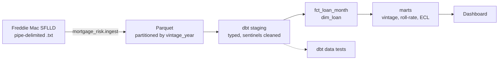

# mortgage-credit-risk-pipeline

End-to-end data pipeline on Freddie Mac loan-level mortgage data: incremental ingestion,
dbt models and data quality tests on DuckDB, producing vintage curves, roll-rate matrices and
IFRS 9 expected credit loss for risk reporting.

## Business question

A lender holding a mortgage portfolio has to answer two questions every month:

1. **How is the book performing?** Which origination cohorts (vintages) are going bad faster,
   and how many loans roll from current to 30, 60, 90+ days past due.
2. **How much must we provision?** Under IFRS 9 the lender books an expected credit loss
   `ECL = PD × LGD × EAD` for each loan, with a 12-month horizon for Stage 1 loans and a
   lifetime horizon for Stage 2 and 3.

The pipeline turns raw servicing files into the tables a credit risk committee would review.

## Architecture



| Layer | Tool | Status |
|---|---|---|
| Ingest raw files to Parquet | Python + DuckDB | done |
| Staging models + data tests | dbt-duckdb | done |
| Loan-month fact, loan dimension | dbt | planned |
| Vintage curves, roll-rate matrix | dbt marts | planned |
| PD model, IFRS 9 staging, ECL | Python | planned |
| Orchestration | Dagster | planned |
| Dashboard | Evidence.dev or Streamlit | planned |

## Data

[Freddie Mac Single-Family Loan-Level Dataset](https://www.freddiemac.com/research/datasets/sf-loanlevel-dataset):
loans originated since 1999 with their monthly performance. It is free for non-commercial use
but requires registration and may not be redistributed, so **no data is committed here**.
See [`data/README.md`](data/README.md) for how to download it.

Two files per vintage:

- **origination**: one row per loan (credit score, LTV, DTI, rate, state, purpose...)
- **performance**: one row per loan per month (balance, delinquency status, loss fields...)

The column order lives in [`config/file_layout.yml`](config/file_layout.yml). Ingest checks each
file's column count against it and fails if they differ, so a layout change from Freddie Mac
cannot silently shift columns.

## Data quality checks

| Check | Where |
|---|---|
| Column count matches the published layout | `ingest.py` |
| Loan ID unique and not null at origination | dbt `unique`, `not_null` |
| Every performance row belongs to a known loan | dbt `relationships` |
| One row per loan per month | `dbt/tests/assert_one_row_per_loan_month.sql` |
| No gaps in a loan's monthly history | `dbt/tests/assert_no_missing_months.sql` |
| Credit score within 300-850 | `dbt/tests/assert_credit_score_in_range.sql` |
| Delinquency bucket is a known value | dbt `accepted_values` |

## Run it

```bash
pip install -e ".[dev]"

# 1. put sample_orig_YYYY.txt and sample_svcg_YYYY.txt in data/raw/ (see data/README.md)
python -m mortgage_risk.ingest data/raw --out data/parquet

# 2. build and test the models
cd dbt && dbt build --profiles-dir .

# unit tests
pytest
```

## Project layout

```
config/file_layout.yml     column order of the raw files
src/mortgage_risk/ingest.py raw .txt -> Parquet, partitioned by vintage year
dbt/models/staging/        typed views over the Parquet files
dbt/tests/                 custom data quality tests
tests/                     unit tests for ingest
data/                      local data, git-ignored
```

## License

Code is MIT licensed. The Freddie Mac data is subject to Freddie Mac's own terms of use.
